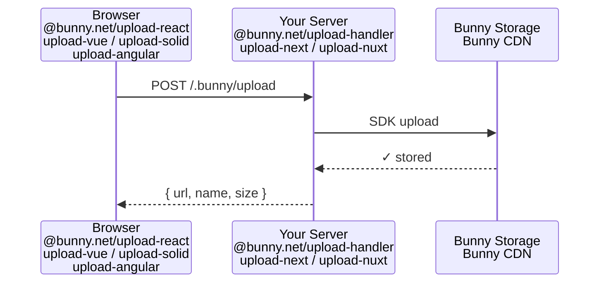
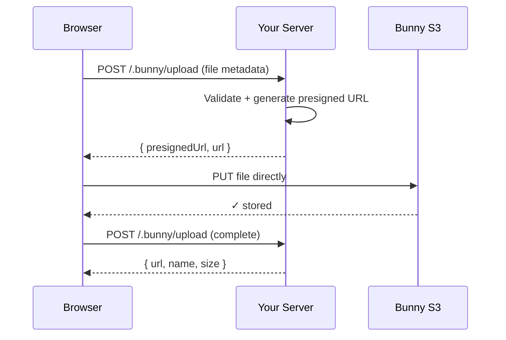

# bunny-upload

Drop-in file uploads for [Bunny Storage](https://bunny.net/storage).

Bunny Storage gives you fast, affordable object storage with a global CDN — but getting files from a user's browser into your storage zone requires plumbing that every team rebuilds from scratch:

1. **No pre-signed URLs** — uploads must be proxied through your server to keep credentials safe
2. **The SDK is server-only** — `@bunny.net/storage-sdk` handles the Bunny Storage API, but there's nothing for the browser
3. **Upload UX is hard** — drag-and-drop, progress bars, validation, retries, error handling… every team builds this from scratch

`bunny-upload` handles everything between your user's browser and Bunny Storage.

## Quickstart

Every setup needs two things: a **server handler** (proxies uploads to Bunny Storage) and a **client component** (handles the UI). Install `@bunny.net/upload` (bundles both client engine + server handler) plus your framework package. Pick your framework below.

### Environment variables

All frameworks use the same env vars:

```env
BUNNY_STORAGE_ZONE=my-zone
BUNNY_STORAGE_PASSWORD=my-password
BUNNY_CDN_BASE=https://my-zone.b-cdn.net
```

<details>
<summary><strong>Next.js</strong></summary>

```bash
npm install @bunny.net/upload @bunny.net/upload-react @bunny.net/upload-next
```

**Server** — `app/.bunny/upload/route.ts`

```ts
import { serveBunnyUpload } from "@bunny.net/upload-next";
import { createBunnyUploadHandler } from "@bunny.net/upload";

export const { POST } = serveBunnyUpload(createBunnyUploadHandler());
```

**Client** — any client component

```tsx
"use client";
import { BunnyUpload } from "@bunny.net/upload-react";

export default function Page() {
  return <BunnyUpload onComplete={(files) => console.log(files)} />;
}
```

[Full example →](./examples/nextjs)

</details>

<details>
<summary><strong>Nuxt</strong></summary>

```bash
npm install @bunny.net/upload @bunny.net/upload-vue @bunny.net/upload-nuxt
```

**Server** — `server/routes/.bunny/upload.post.ts`

```ts
import { defineBunnyUploadHandler } from "@bunny.net/upload-nuxt";
import { createBunnyUploadHandler } from "@bunny.net/upload";

export default defineBunnyUploadHandler(createBunnyUploadHandler());
```

**Client** — `app.vue` or any component

```vue
<script setup>
import { BunnyUpload } from "@bunny.net/upload-vue";
</script>

<template>
  <BunnyUpload @complete="console.log" />
</template>
```

[Full example →](./examples/nuxt)

</details>

<details>
<summary><strong>Vue</strong></summary>

```bash
npm install @bunny.net/upload @bunny.net/upload-vue
```

You'll need a backend server (Express, Hono, Fastify, etc.) to handle uploads. The handler works with any framework that supports standard `Request`/`Response`.

**Client**

```vue
<script setup>
import { BunnyUpload } from "@bunny.net/upload-vue";
</script>

<template>
  <BunnyUpload @complete="console.log" />
</template>
```

[Full example →](./examples/vue)

</details>

<details>
<summary><strong>React Router</strong></summary>

```bash
npm install @bunny.net/upload @bunny.net/upload-react
```

**Server** — `app/routes/upload.tsx` (action)

```ts
import { createBunnyUploadHandler } from "@bunny.net/upload";

const handler = createBunnyUploadHandler();

export async function action({ request }: { request: Request }) {
  return handler(request);
}
```

**Client**

```tsx
import { BunnyUpload } from "@bunny.net/upload-react";

export default function Home() {
  return <BunnyUpload onComplete={(files) => console.log(files)} />;
}
```

[Full example →](./examples/react-router)

</details>

<details>
<summary><strong>TanStack Start</strong></summary>

```bash
npm install @bunny.net/upload @bunny.net/upload-react
```

**Client**

```tsx
import { BunnyUpload } from "@bunny.net/upload-react";

export default function Home() {
  return <BunnyUpload onComplete={(files) => console.log(files)} />;
}
```

[Full example →](./examples/tanstack-start)

</details>

<details>
<summary><strong>SolidStart</strong></summary>

```bash
npm install @bunny.net/upload-solid @bunny.net/upload
```

**Server** — `src/routes/.bunny/upload.ts`

```ts
import type { APIEvent } from "@solidjs/start/server";
import { createBunnyUploadHandler } from "@bunny.net/upload";

const handler = createBunnyUploadHandler();

export async function POST(event: APIEvent) {
  return handler(event.request);
}
```

**Client**

```tsx
import { BunnyUpload } from "@bunny.net/upload-solid";

export default function Home() {
  return <BunnyUpload onComplete={(files) => console.log(files)} />;
}
```

[Full example →](./examples/solidstart)

</details>

<details>
<summary><strong>Angular</strong></summary>

```bash
npm install @bunny.net/upload-angular
```

You'll need a backend server to handle uploads (see Hono or vanilla server examples).

**Client**

```ts
import { Component } from "@angular/core";
import { BunnyUploadComponent } from "@bunny.net/upload-angular";

@Component({
  selector: "app-root",
  standalone: true,
  imports: [BunnyUploadComponent],
  template: `<bunny-upload (completed)="onComplete($event)" />`,
})
export class AppComponent {
  onComplete(files: any[]) { console.log(files); }
}
```

[Full example →](./examples/angular)

</details>

<details>
<summary><strong>Hono</strong></summary>

```bash
npm install @bunny.net/upload hono
```

```ts
import { Hono } from "hono";
import { createBunnyUploadHandler } from "@bunny.net/upload";

const app = new Hono();

const handler = createBunnyUploadHandler();

app.post("/.bunny/upload", (c) => handler(c.req.raw));

export default app;
```

[Full example →](./examples/hono)

</details>

<details>
<summary><strong>Vanilla HTML + JS</strong></summary>

```bash
npm install @bunny.net/upload
```

No framework needed. Use `createDropzone` to attach drag-and-drop to any element:

```html
<div id="dropzone">Drop files here or click to browse</div>
<script src="/bunny-upload.js"></script>
<script>
  const dropzone = BunnyUpload.createDropzone(document.getElementById("dropzone"), {
    onDragOver: (isDragOver) => {
      document.getElementById("dropzone").classList.toggle("active", isDragOver);
    },
    onComplete: (files) => console.log("Uploaded:", files),
  });

  document.getElementById("dropzone").addEventListener("click", () => dropzone.openFilePicker());
</script>
```

[Full example →](./examples/vanilla)

</details>

## Components

Each framework package provides three levels of control:

### Drop-in component

Everything included — drag-and-drop zone, file list, progress bars, error states, retry.

```tsx
<BunnyUpload accept={["image/*"]} maxSize="10mb" maxFiles={5} onComplete={(files) => console.log(files)} />
```

### Custom dropzone

Full control over the UI. You provide the markup, we handle the behaviour.

```tsx
<UploadDropzone accept={["image/*"]} maxSize="10mb" onComplete={(files) => console.log(files)}>
  {({ isDragOver, openFilePicker, files, getDropzoneProps, getInputProps }) => (
    <div {...getDropzoneProps()} onClick={openFilePicker}>
      <input {...getInputProps()} />
      <p>{isDragOver ? "Drop!" : "Drag files here"}</p>
      {files.map((f) => <div key={f.id}>{f.name} — {f.progress}%</div>)}
    </div>
  )}
</UploadDropzone>
```

### Headless hook/composable

Maximum flexibility — just the state and methods, zero UI.

```tsx
const { files, addFiles, upload, reset, isUploading } = useBunnyUpload({
  accept: ["image/*"],
  maxSize: "10mb",
});
```

## File Manager

Browse, select, and manage files already in your Bunny Storage zone. Like uploads, it needs a **server handler** and a **client component**.

### Server setup

```ts
// app/.bunny/files/route.ts (Next.js)
import { serveBunnyFileManager } from "@bunny.net/upload-next";
import { createFileManagerHandler } from "@bunny.net/file-manager-handler";

export const { GET, POST, DELETE } = serveBunnyFileManager(
  createFileManagerHandler()
);
```

### Widget

A ready-to-use dialog with grid view, breadcrumbs, and file selection. Users pick files and you get the CDN URLs back.

```tsx
import { FileManagerWidget } from "@bunny.net/upload-react";

<FileManagerWidget
  accept={["jpg", "png", "webp"]}
  onSelect={(entries, urls) => console.log("Selected:", urls)}
  trigger={({ open }) => <button onClick={open}>Pick image</button>}
/>
```

With `allowMultiple={false}`, clicking a file immediately fires `onSelect` and closes the dialog — no confirm step:

```tsx
<FileManagerWidget
  allowMultiple={false}
  onSelect={(entries, urls) => setImage(urls[0])}
/>
```

Use the `value` prop to pre-select files when the dialog opens (e.g. to restore a previous selection):

```tsx
const [selected, setSelected] = useState<string[]>([]);

<FileManagerWidget
  value={selected}
  onSelect={(entries, urls) => {
    setSelected(entries.map(e => e.path + e.objectName));
  }}
/>
```

You can provide custom actions in the footer when files are selected, and per-entry actions on each item in the grid:

```tsx
import { copyUrlAction, downloadAction } from "@bunny.net/file-manager-core/actions";

// Footer actions (collective) — shown when files are selected
<FileManagerWidget
  renderActions={({ selected, urls, actions, executeAction }) => (
    <>
      <button onClick={() => navigator.clipboard.writeText(urls[0])}>Copy URL</button>
      <button onClick={() => insertImage(urls[0])}>Insert</button>
    </>
  )}
/>

// Per-entry actions — rendered on each item in the grid/list
<FileManagerWidget
  actions={[copyUrlAction, downloadAction]}
  renderEntryActions={({ entry, url, actions, executeAction }) => (
    <>
      {actions.map(a => (
        <button key={a.id} onClick={() => executeAction(a.id)}>{a.label}</button>
      ))}
    </>
  )}
/>
```

### Render props

Full control over the UI — the component provides all state and methods.

```tsx
import { FileManager } from "@bunny.net/upload-react";

<FileManager>
  {({ entries, selected, selectedUrls, navigate, toggleSelect, breadcrumbs }) => (
    <div>
      {entries.map(entry => (
        <div key={entry.guid} onClick={() =>
          entry.isDirectory
            ? navigate(entry.path + entry.objectName + "/")
            : toggleSelect(entry.guid)
        }>
          {entry.objectName}
        </div>
      ))}
      {selected.length > 0 && (
        <button onClick={() => onInsert(selectedUrls)}>
          Use {selected.length} file(s)
        </button>
      )}
    </div>
  )}
</FileManager>
```

### Headless hook

Maximum flexibility — just state and methods, zero UI.

```tsx
import { useFileManager } from "@bunny.net/upload-react";

const {
  entries, currentPath, selected, breadcrumbs,
  navigate, goUp, toggleSelect, deselectAll,
  cdnUrl, deleteEntry, createFolder, refresh,
} = useFileManager();
```

See the [React package docs](./packages/react) for full API reference and the [Next.js example](./examples/nextjs) for a working demo of all three approaches.

## Packages

| Package | Description |
|---|---|
| [`@bunny.net/upload`](./packages/upload) | Meta-package — re-exports both client engine and server handler |
| [`@bunny.net/upload-core`](./packages/core) | Framework-agnostic upload engine and `createDropzone` |
| [`@bunny.net/upload-handler`](./packages/handler) | Server-side proxy to Bunny Storage |
| [`@bunny.net/file-manager-core`](./packages/file-manager-core) | Framework-agnostic file manager engine |
| [`@bunny.net/file-manager-handler`](./packages/file-manager-handler) | Server-side handler for browsing, deleting, and importing files |
| [`@bunny.net/upload-react`](./packages/react) | React hooks, components, file manager, and `UploadDropzone` |
| [`@bunny.net/upload-vue`](./packages/vue) | Vue composable, component, and `UploadDropzone` |
| [`@bunny.net/upload-next`](./packages/next) | Next.js App Router adapter |
| [`@bunny.net/upload-nuxt`](./packages/nuxt) | Nuxt server route adapter |
| [`@bunny.net/upload-solid`](./packages/solid) | SolidJS primitive, component, and `UploadDropzone` |
| [`@bunny.net/upload-angular`](./packages/angular) | Angular service, component, and `bunnyDropzone` directive |

## How it works



The client sends files to your own server (same-origin, so cookies are included automatically). The handler validates the request, streams files to Bunny Storage using `@bunny.net/storage-sdk`, and returns the CDN URLs.

### Presigned uploads (S3-compatible zones)

If your storage zone has S3 compatibility enabled, you can upload files directly from the browser to Bunny Storage — bypassing your server entirely for the file transfer. Your server only handles signing and validation.



**Server** — no changes needed (the handler auto-detects presign requests):

```ts
createBunnyUploadHandler({
  restrictions: { maxFileSize: "10mb", allowedTypes: ["image/*"] },
  getPath: (file) => `/uploads/${Date.now()}-${file.name}`,
});
```

Your existing `BUNNY_STORAGE_ZONE`, `BUNNY_STORAGE_PASSWORD`, and `BUNNY_STORAGE_REGION` env vars are reused as S3 credentials — no extra config.

**Client** — add the `presigned` prop:

```tsx
<BunnyUpload presigned accept={["image/*"]} maxSize="10mb" />
```

Or with the headless hook:

```tsx
const { files, addFiles, upload } = useBunnyUpload({
  presigned: true,
  accept: ["image/*"],
  maxSize: "10mb",
});
```

> **Note:** Presigned uploads require an S3-compatible storage zone (Frankfurt `de`, New York `ny`, or Singapore `sg`). S3 compatibility must be enabled during zone creation.

## Auth

Since uploads go to your own server, the browser sends cookies automatically. Use `onBeforeUpload` to validate the session:

```ts
import { createBunnyUploadHandler, UploadError } from "@bunny.net/upload";

createBunnyUploadHandler({
  onBeforeUpload: async (_file, req) => {
    const cookie = req.headers.get("cookie");
    const session = await getSession(cookie);
    if (!session) throw new UploadError("Unauthorized", 401);
  },
});
```

## Configuration

See [`@bunny.net/upload`](./packages/upload) for all server-side options (`getPath`, `onBeforeUpload`, `onAfterUpload`, storage regions) and client-side options (restrictions, events, utilities).

## License

MIT
